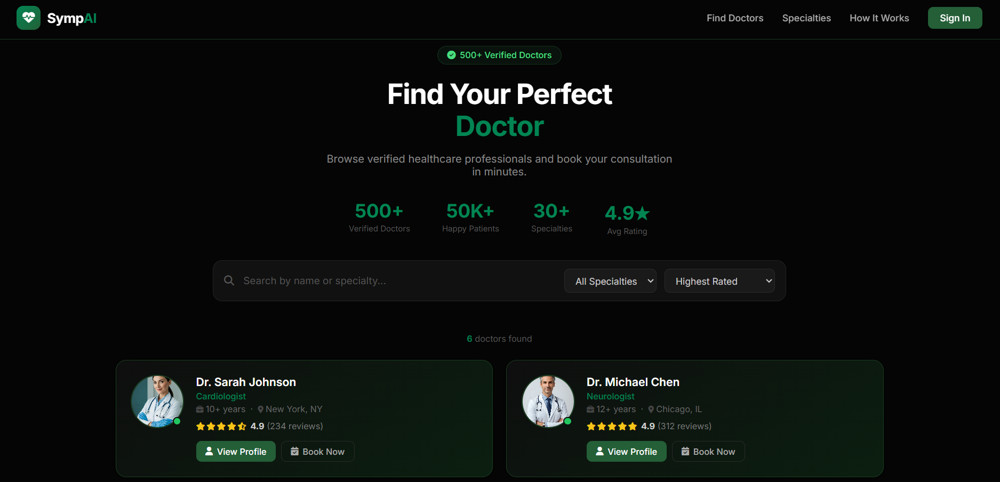

# SympAI Doctor Portal 🩺🤖

An AI-powered healthcare platform designed and developed to help doctors manage patient consultations, analyze symptoms intelligently, and streamline healthcare workflows through a modern and responsive interface.

## Preview

## About the project

SympAI Doctor Portal was built to bridge the gap between healthcare and artificial intelligence by providing doctors with a smart platform for symptom analysis and patient management.

The goal of this project was to create a professional medical dashboard that simplifies the consultation process while delivering an intuitive, modern user experience. The platform focuses on usability, efficiency, and clean UI design — helping healthcare professionals access patient information and AI-generated insights seamlessly.

## Features

- AI-powered symptom analysis assistance
- Modern doctor dashboard with intuitive navigation
- Patient consultation and management system
- Responsive UI across mobile, tablet, and desktop
- Interactive cards, charts, and healthcare insights
- Clean dark-themed medical interface
- Smooth animations and transitions for better UX
- Organized sections for appointments, reports, and records

## Tech used

## What I focused on

- Designing a modern healthcare dashboard UI
- Building responsive layouts using Flexbox and CSS Grid
- Creating clean and user-friendly medical interfaces
- Implementing smooth animations and transitions
- Structuring scalable frontend architecture
- Enhancing usability for healthcare professionals

## Sections

| Section | Description |
|---------|-------------|
| Dashboard | Overview of patients, reports, and statistics |
| Symptom Analysis | AI-assisted symptom checking and insights |
| Patients | Patient details and consultation records |
| Reports | Medical reports and analysis overview |
| Contact | Support and communication section |

## How to run

1. Clone the repository or download the files
2. Open the `.html` file in your browser
3. No installations or dependencies required

## Live demo

[View it here](https://vaishnavi280506.github.io/SympAI/)

## Built by

Vaishnavi Vingale · [LinkedIn](https://www.linkedin.com/in/vaishnavi-vingale-08a517345) · [GitHub](https://github.com/Vaishnavi280506)
